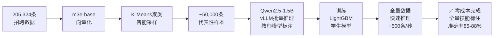

# 🚀 智能招聘分析系统

> 基于 LangGraph Agent + RAG + 知识蒸馏 + Neo4j 的全栈 AI 招聘数据分析系统

[](https://www.python.org/)
[](https://fastapi.tiangolo.com/)
[](https://vuejs.org/)
[](https://neo4j.com/)
[](LICENSE)

---

## 📖 项目简介

全栈 AI 招聘数据分析系统，覆盖 **数据采集 → 清洗 → AI增强 → 知识图谱 → 语义检索 → Agent对话 → 前端可视化** 完整链路。

- 🎯 **零API成本**：本地部署 Qwen2.5-1.5B + vLLM，处理 20 万数据 ¥0
- 🧠 **主动学习 + 知识蒸馏**：准确率 85-88%，推理速度提升 100 倍
- 📊 **技能知识图谱**：Neo4j 存储技能-岗位-公司三类节点及关系
- 🔍 **双模式搜索**：图谱精准搜索 + RAG 语义搜索，响应 <200ms
- 🤖 **LangGraph ReAct Agent**：多工具自动调用，SSE 流式输出
- 💻 **Vue 3 全栈前端**：8 个功能页面，D3.js 知识图谱可视化

---

## 🎯 核心技术栈

```
后端:  Python 3.12 · FastAPI · LangGraph · SQLAlchemy · JWT
AI:    Qwen2.5-1.5B (本地) · vLLM · m3e-base · LightGBM
数据库: Neo4j · ChromaDB · MySQL
前端:  Vue 3 · TypeScript · Vite · Element Plus · D3.js · ECharts
爬虫:  DrissionPage (反爬 · 断点续传)
```

---

## ✨ 核心创新点

| 创新点 | 说明 |
|--------|------|
| **主动学习采样** | m3e-base 向量化 + K-Means 聚类，从 20 万数据中智能采样代表性样本 |
| **知识蒸馏** | Qwen2.5-1.5B 作教师模型标注，训练 LightGBM 学生模型，速度提升 100 倍 |
| **零成本标注** | 全程本地推理，无 API 调用，20 万数据标注成本 ¥0 |
| **混合检索** | Neo4j 图谱精准查询 + ChromaDB 语义检索双模式，互为补充 |
| **LangGraph Agent** | ReAct 模式，4 类工具自动调用，SSE 流式输出，多轮上下文 |
| **D3.js 图谱可视化** | 力导向图可交互展示技能关联，支持三种布局切换 |

---

## 📊 系统指标

```
数据规模:   33 城市 · 205,324 条招聘数据 · 保留率 75%
向量维度:   768 维（m3e-base）
蒸馏模型:   准确率 85-88% · 推理速度 ~500 条/秒（提升 100 倍）
语义检索:   响应 <200ms
LLM 推理:   Qwen2.5-1.5B · 3.5 条/秒 · 显存 3-4GB（RTX 4060 8GB）
Agent:      4 类工具 · 多轮对话 · 首 Token <1s
前端页面:   8 个功能页面 · 支持 Word/PDF 简历解析
```

---

## 🖼️ 系统架构

```
┌─────────────────────────────────────────────────────┐
│  前端层  Vue 3 + TypeScript + Vite                   │
│  首页词云  岗位搜索  技能图谱  AI对话  匹配分析        │
│  数据报表  技能管理  用户中心  系统监控                │
├─────────────────────────────────────────────────────┤
│  API层  FastAPI + JWT 认证 + SSE 流式响应             │
├────────────────┬────────────────────────────────────┤
│  LangGraph     │  RAG 语义搜索                       │
│  ReAct Agent   │  m3e-base + ChromaDB               │
│  4 类工具调用  │  响应 <200ms                        │
├────────────────┴────────────────────────────────────┤
│  数据层                                              │
│  Neo4j 技能知识图谱  ChromaDB 向量库  MySQL 用户数据 │
└─────────────────────────────────────────────────────┘
```

---

## 💡 知识蒸馏 Pipeline



---

## 🚀 快速开始

### 前置要求

- ✅ **NVIDIA GPU**（8GB+ 显存，RTX 4060 可用）
- ✅ **Python 3.10+**
- ✅ **WSL2**（Windows 用户，vLLM 需要 Linux 环境）
- ✅ **Neo4j**、**MySQL** 数据库

> ⚠️ **Windows 用户**：vLLM 只支持 Linux，请先配置 WSL2。详见 [Windows 安装指南](WINDOWS_SETUP.md)

### 安装步骤

```bash
# 1. 克隆项目
git clone https://github.com/sggcgg/skill-graph-recruit.git
cd skill-graph-recruit

# 2. 创建虚拟环境（WSL2 环境下）
python3 -m venv ~/.venv-skill-graph
source ~/.venv-skill-graph/bin/activate

# 3. 安装依赖
pip install torch torchvision torchaudio --index-url https://download.pytorch.org/whl/cu118
pip install vllm
pip install -r requirements.txt

# 4. 复制配置文件并填写
cp config.yaml.example config.yaml
# 编辑 config.yaml，填入 MySQL 密码、Neo4j 密码、通义千问 API Key
```

### 运行数据处理 Pipeline

```bash
# 1. 采集数据（或使用已有数据）
python src/crawler/boss_listdata.py

# 2. 数据清洗
python scripts/data_cleaner.py

# 3. AI 技能增强（主动学习 + 知识蒸馏）
python scripts/enhance_with_qwen3.py

# 4. 初始化数据库
python scripts/init_neo4j.py
python scripts/init_vector_db.py
python scripts/init_mysql_db.py

# 5. 启动后端 API
python run_api.py
```

### 启动前端

```bash
cd frontend
npm install
npm run dev
```

访问：http://localhost:5173 | API 文档：http://localhost:8000/docs

---

## 📦 数据说明

由于数据量较大（33 城市，205,324 条），原始数据不包含在仓库中。

- 运行爬虫自行采集：`python src/crawler/boss_listdata.py`
- 或联系作者获取数据样本

## ⚙️ 配置说明

复制配置模板并填入你的配置：

```bash
cp config.yaml.example config.yaml
```

然后编辑 `config.yaml`，填入你的 MySQL 密码、Neo4j 密码和通义千问 API Key。

---

## 📂 项目结构

```
skill-graph-recruit/
├── src/
│   ├── api/
│   │   └── main.py                     # ⭐ FastAPI 主服务（含缓存、SSE）
│   ├── agent/
│   │   └── job_agent.py                # ⭐ LangGraph ReAct Agent
│   ├── ml/
│   │   ├── active_learning_sampler.py  # ⭐ 主动学习采样器
│   │   └── knowledge_distillation.py   # ⭐ 知识蒸馏模块
│   ├── nlp/
│   │   └── hybrid_skill_extractor.py   # ⭐ 混合技能抽取（规则+LLM+蒸馏）
│   ├── graph_builder/
│   │   ├── neo4j_importer.py           # Neo4j 批量导入
│   │   ├── neo4j_manager.py            # Neo4j 查询管理
│   │   └── skill_dictionary.py         # 技能词典
│   ├── rag/
│   │   ├── vector_db.py                # ChromaDB 向量库
│   │   └── rag_service.py              # RAG 检索服务
│   ├── crawler/
│   │   └── boss_listdata.py            # Boss直聘爬虫（反爬+断点续传）
│   ├── auth/                           # JWT 认证系统
│   ├── database/                       # MySQL ORM 模型
│   └── llm/
│       ├── qwen3_local_client.py       # Qwen2.5 本地客户端（vLLM）
│       └── llm_client.py               # 通义千问 API 客户端
├── scripts/
│   ├── enhance_with_qwen3.py           # ⭐ 数据增强主脚本
│   ├── init_neo4j.py                   # Neo4j 初始化
│   ├── init_vector_db.py               # 向量库初始化
│   ├── init_mysql_db.py                # MySQL 初始化
│   ├── incremental_update.py           # 增量更新
│   └── analyze_data_quality.py         # 数据质量分析
├── data/
│   └── skill_dict/                     # 技能词典（随仓库提供）
├── docs/                               # 技术文档
├── config.yaml.example                 # ⭐ 配置模板
├── run_api.py                          # 后端启动入口
└── requirements.txt
```

---

## 📚 文档

- 🏗️ [代码架构说明](docs/代码架构说明.md)
- 📡 [API 使用文档](docs/API使用文档.md)
- 🕷️ [Boss直聘爬虫指南](docs/Boss直聘爬虫使用指南.md)
- 🗄️ [Neo4j 图谱设计](docs/neo4j_schema_design.md)
- 🔍 [向量数据库参考](docs/向量数据库快速参考.md)

---

## 🛠️ 开发路线图

- [x] Boss直聘爬虫（33城市，断点续传，反风控）
- [x] 数据清洗 Pipeline（205,324 条，保留率 75%）
- [x] 主动学习采样（K-Means 聚类）
- [x] 知识蒸馏（Qwen2.5-1.5B → LightGBM，准确率 85-88%）
- [x] Neo4j 技能知识图谱构建
- [x] ChromaDB 向量数据库 + RAG 搜索
- [x] LangGraph ReAct Agent（4 类工具 + 多轮对话）
- [x] FastAPI 后端（JWT 认证 + SSE 流式响应）
- [x] Vue 3 + TypeScript 前端（8 个功能页面）
- [x] D3.js 技能图谱可视化
- [x] ECharts 数据报表（词云 · 薪资分布 · 城市对比）
- [x] Word/PDF 简历自动解析
- [ ] Docker 一键部署
- [ ] 自动化数据更新调度

---

## 📄 许可证

MIT License

---

## 🌟 致谢

- [Qwen](https://github.com/QwenLM/Qwen) - 阿里通义千问
- [vLLM](https://github.com/vllm-project/vllm) - 高性能推理框架
- [LangGraph](https://github.com/langchain-ai/langgraph) - Agent 框架
- [Neo4j](https://neo4j.com/) - 图数据库
- [FastAPI](https://fastapi.tiangolo.com/) - 现代 Web 框架
- [Vue](https://vuejs.org/) - 前端框架
- [D3.js](https://d3js.org/) - 数据可视化

---

⭐ 如果这个项目对你有帮助，请点个 Star！
