# 🗺️ 智能招聘分析系统 - 前端功能流程图

> **文档说明**: 完整的前端页面跳转关系和功能交互流程

---

## 📊 一、整体架构流程图

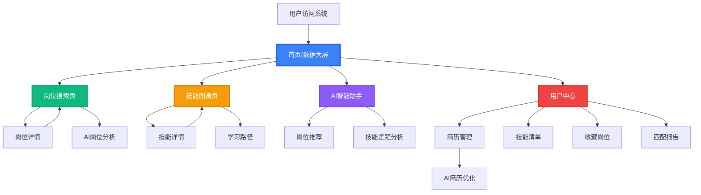

---

## 🏠 二、首页交互流程

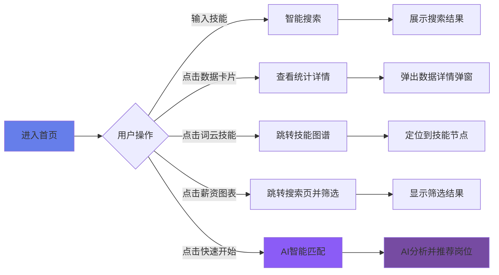

### 首页关键交互点

1. **Hero区搜索框**
   - 输入监听 → 自动补全建议
   - 点击搜索 → 跳转搜索页
   - 点击AI搜索 → 调用AI语义分析

2. **数据卡片**
   - Hover显示详细说明
   - 点击展开数据趋势图

3. **技能词云**
   - Hover放大技能标签
   - 点击跳转到技能图谱并聚焦该技能

4. **薪资分布图**
   - Hover显示详细数据
   - 点击柱状图跳转到搜索页并应用城市筛选

---

## 🔍 三、岗位搜索页流程

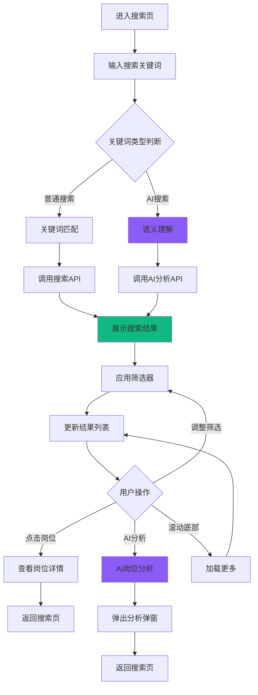

### 搜索页状态管理

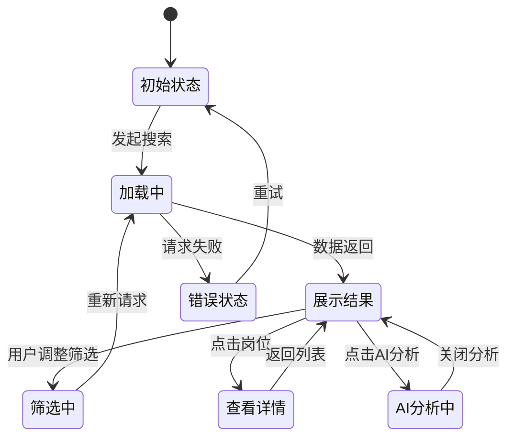

---

## 🕸️ 四、技能图谱页流程

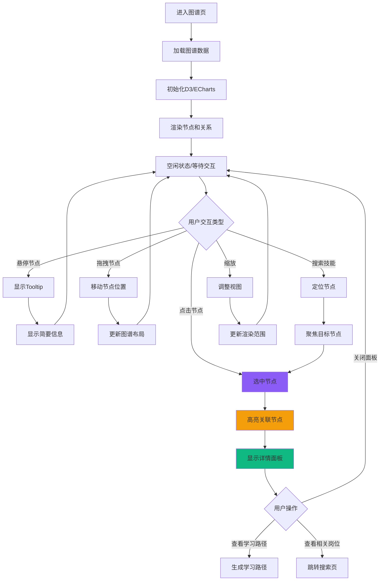

### 图谱交互矩阵

| 交互操作 | 触发方式 | 视觉反馈 | 后续操作 |
|---------|---------|---------|---------|
| 选中节点 | 单击 | 节点放大+高亮+关联线高亮 | 显示详情面板 |
| 悬停节点 | Hover | 节点轻微放大+显示Tooltip | 无 |
| 拖拽节点 | 按住拖动 | 实时跟随鼠标移动 | 更新布局 |
| 搜索技能 | 输入框搜索 | 平滑移动视图+节点闪烁 | 自动选中 |
| 缩放视图 | 滚轮/手势 | 平滑缩放动画 | 无 |
| 双击节点 | 双击 | 展开二级关联 | 加载关联数据 |

---

## 💬 五、AI助手对话流程

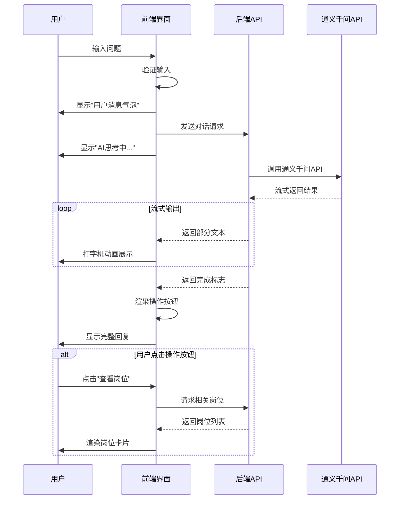

### AI对话状态机

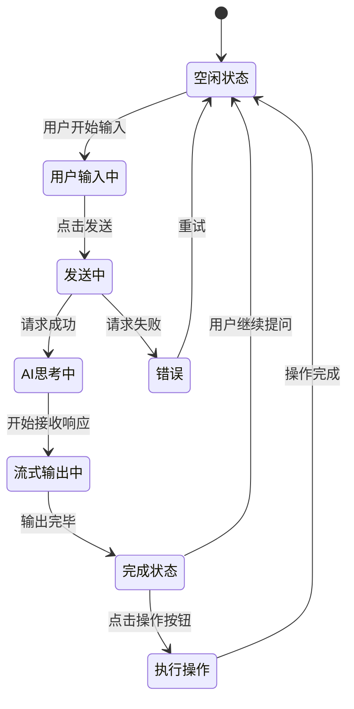

### 快速问题流程

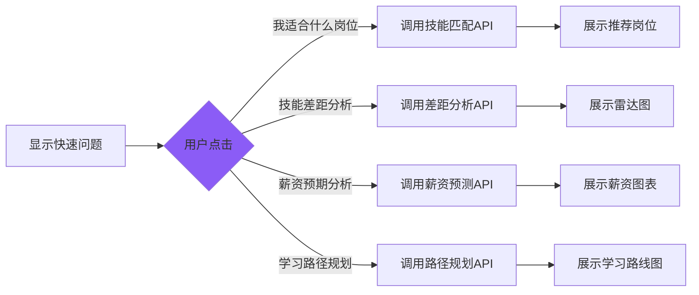

---

## 👤 六、用户中心页流程

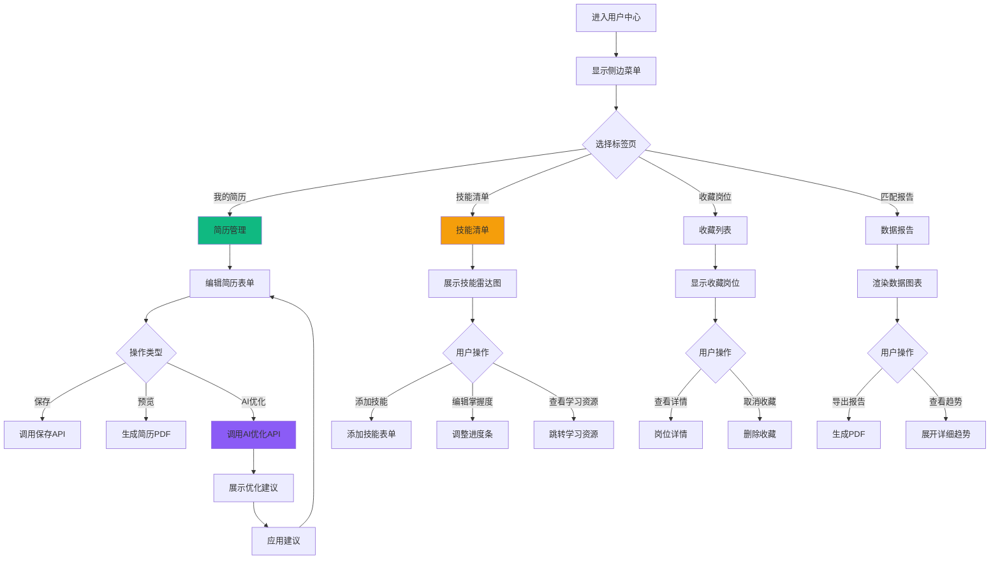

---

## 📱 七、移动端交互流程

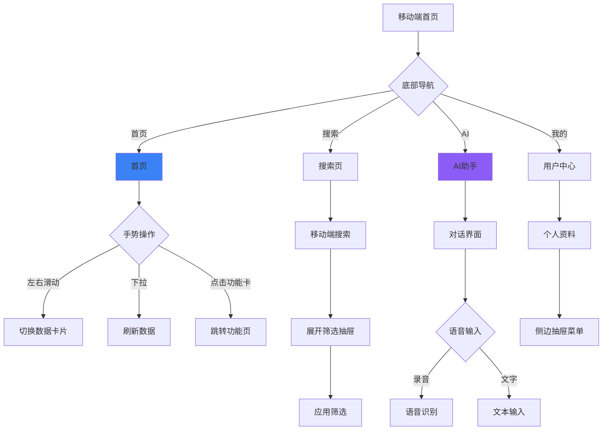

---

## 🔄 八、核心数据流转图

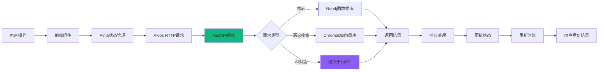

---

## 🎯 九、关键功能详细流程

### 9.1 智能搜索流程

```mermaid
graph TB
    A[用户输入: "我想做AI工程师"] --> B{输入类型识别}
    
    B -->|关键词搜索| C[分词处理]
    B -->|自然语言| D[NLP语义分析]
    
    C --> E[关键词匹配]
    D --> F[意图识别]
    
    F --> G[提取技能要求]
    G --> H[调用向量检索]
    
    E --> I[Neo4j图谱查询]
    H --> I
    
    I --> J[计算匹配度]
    J --> K[排序筛选]
    K --> L[返回Top N结果]
    
    L --> M[前端展示]
    M --> N[用户查看]
    
    N --> O{用户操作}
    O -->|点击岗位| P[查看详情]
    O -->|AI分析| Q[深度分析]
    O -->|调整筛选| A
    
    style D fill:#8b5cf6
    style Q fill:#8b5cf6
```

### 9.2 技能差距分析流程

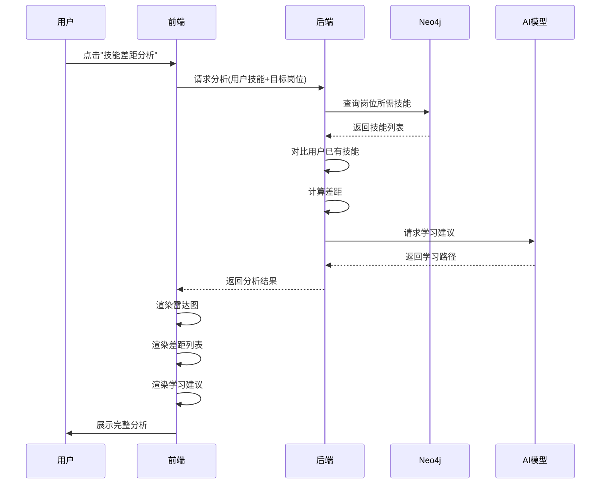

### 9.3 AI简历优化流程

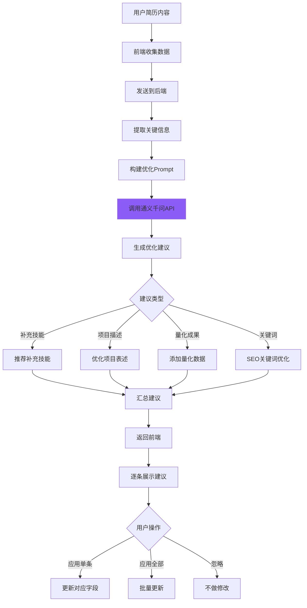

---

## 🎨 十、页面跳转导航图

```
首页 ─────┐
          ├───→ 搜索页 ───→ 岗位详情 ───→ AI分析弹窗
          │                    ↓
          │                收藏按钮 ───→ 用户中心(收藏列表)
          │
          ├───→ 图谱页 ───→ 技能详情面板 ───→ 学习路径
          │                    ↓
          │                相关岗位 ───→ 搜索页
          │
          ├───→ AI助手 ───→ 推荐结果 ───→ 岗位列表
          │         ↓
          │     历史对话
          │
          └───→ 用户中心 ───┬───→ 简历管理 ───→ AI优化
                            ├───→ 技能清单 ───→ 学习资源
                            ├───→ 收藏岗位 ───→ 岗位详情
                            └───→ 匹配报告 ───→ 导出PDF
```

---

## 📊 十一、组件复用关系图

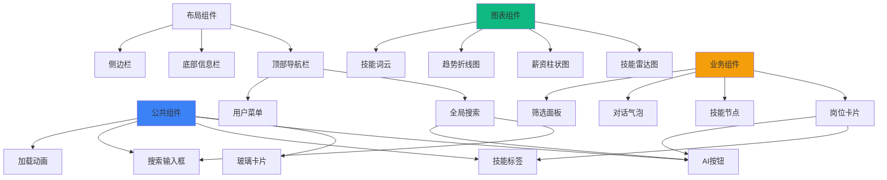

---

## 🚀 十二、性能优化流程

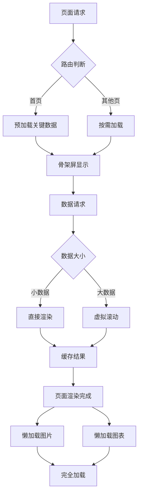

---

## 📝 十三、错误处理流程

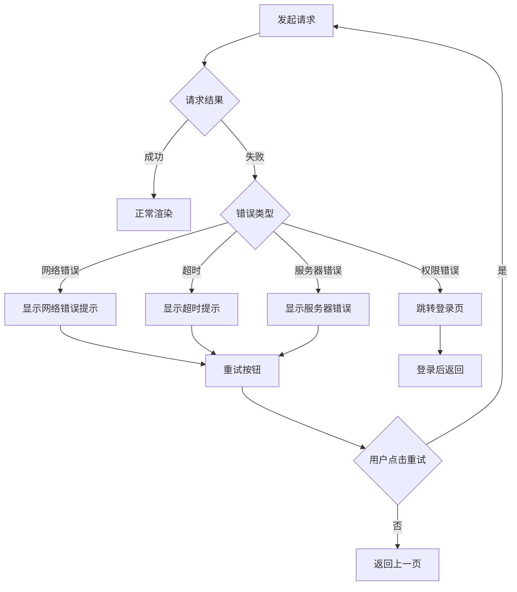

---

## 🎯 总结

### 核心流程特点

1. **用户体验优先**
   - 流畅的页面跳转
   - 实时反馈
   - 错误处理完善

2. **AI能力突出**
   - 多处AI分析入口
   - 智能推荐无处不在
   - 对话式交互

3. **数据驱动**
   - 实时数据更新
   - 可视化展示
   - 智能缓存

4. **性能优化**
   - 按需加载
   - 虚拟滚动
   - 骨架屏

### 可展示的技术深度

- 完整的前端架构设计
- 复杂的状态管理
- 流畅的交互体验
- 企业级的错误处理

---

**流程图设计完成！** 🎉
